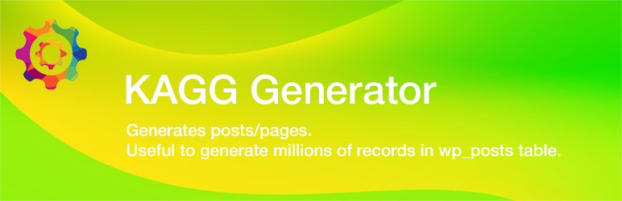

# KAGG Generator

The plugin generates posts/pages. Useful to generate millions of records in wp_posts table.

In WordPress development, sometimes it is needed to generate big databases with hundreds of thousands of posts/pages. Existing plugins can generate test content, but very slowly, with the usual rate of 1,000 posts per hour.

The Fast Post Generator plugin is able to generate millions of posts/pages in minutes.



## Features

* Plugin generates posts/pages with random content.

## Installation

```
git clone https://github.com/kagg-design/kagg-fast-post-generator.git
cd kagg-fast-post-generator
composer install --no-dev
```

## Development

```
git clone https://github.com/kagg-design/kagg-fast-post-generator.git
cd kagg-fast-post-generator
composer install
```

## License

The WordPress Plugin KAGG Fast Post Generator is licensed under the GPL v2 or later.

> This program is free software; you can redistribute it and/or modify it under the terms of the GNU General Public License, version 2, as published by the Free Software Foundation.

> This program is distributed in the hope that it will be useful, but WITHOUT ANY WARRANTY; without even the implied warranty of MERCHANTABILITY or FITNESS FOR A PARTICULAR PURPOSE. See the GNU General Public License for more details.

> You should have received a copy of the GNU General Public License along with this program; if not, write to the Free Software Foundation, Inc., 51 Franklin St, Fifth Floor, Boston, MA 02110-1301 USA

A copy of the license is included in the root of the plugin’s directory. The file is named `LICENSE`.

## Credits

The current version of the KAGG Fast Post Generator was developed by KAGG Design.
